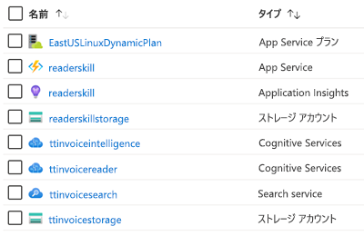

# AIML10: Making Sense of your Unstructured Data with AI

## Session Abstract

Tailwind Traders has a lot of legacy data that they’d like their developers to leverage in their apps – from various sources, both structured and unstructured, and including images, forms, pdf files, and several others. In this session, you'll learn how the team used Cognitive Search to make sense of this data in a short amount of time and with amazing success. We'll discuss tons of AI concepts, like the ingest-enrich-explore pattern, skillsets, cognitive skills, natural language processing, computer vision, and beyond.

## Table of Content
 

| Resources          | Links                            |
|-------------------|----------------------------------|
| PowerPoint        | - [Presentation](presentations.md) |
| Videos            | - [Dry Run Rehearsal](https://www.youtube.com/watch?v=dm0wDTSso0E)  - [Microsoft Ignite Orlando Recording](https://myignite.techcommunity.microsoft.com/sessions/82986?source=sessions) |
| Demos             | - [Demo 1 - Azure Cognitive Search ](https://github.com/microsoft/ignite-learning-paths-training-aiml/blob/master/aiml10/demo1.md)  - [Demo 2 - Forms Recognizer Service](https://github.com/microsoft/ignite-learning-paths-training-aiml/blob/master/aiml10/demo2.md)  - [Demo 3 - Creating a Custom Invoice Reader Skill](https://github.com/microsoft/ignite-learning-paths-training-aiml/blob/master/aiml10/demo3.md) - [Demo 4 - Tying it all Together](https://github.com/microsoft/ignite-learning-paths-training-aiml/blob/master/aiml10/demo4.md)  - [Demo 5 - Knowledge Store](https://github.com/microsoft/ignite-learning-paths-training-aiml/blob/master/aiml10/demo5.md) | 

# Overview
In this solution we develop a process whereby we take a set of unstructured pdf invoices and generate structured tabular output using Azure Cognitive Search with a customized Form Recognizer Skill. 

When creating this solution there are a few Azure resources ([free trial here](https://azure.microsoft.com/en-gb/free/?WT.mc_id=msignitethetour2019-github-aiml10) if you need it) that are created. The following tables list each resource, its purpose, and any special instructions needed to implement the solution fully (I use the names as presented during the talk but they will need to be renamed for your particular solution):

## Azure Resources

| Name                       | Type                            | Purpose                    |
| -------------------------- | ------------------------------- | ------------------------- |
| **ttcognitivesearch**     | Resource Group                  | Groups services together   |
| **ttinvoicestorage**      | Storage Account                 | Used to store invoices     |
| **ttinvoicesearch**       | Search Service                  | Featured service           |
| **ttinvoiceintelligence** | Cognitive Services (All-In-One) | Used in the search service |
| **ttinvoicereader**       | Form Recognizer Service         | This service will eventually end up in the All-In-One sevice. For right now it is in limited-access preview. To get access to the preview, fill out and submit the [Form Recognizer access request](https://aka.ms/FormRecognizerRequestAccess) form.  |
| **readerskillstorage**   | Storage Account              | Storage used for Azure Function |
| **readerskill**          | Function App                 | Cognitive Skill App |
| **readerskill**          | App Insights                   | Adds insights to Function App |
| **EastUS2LinuxDynamicPlan** | App Service Plan                   | Consumption based plan for running Function App |

# Presentation

* [PowerPoint Download](https://globaleventcdn.blob.core.windows.net/assets/aiml/aiml10/aiml10.pptx)
* [Microsoft Ignite Orlando Session Video](https://myignite.techcommunity.microsoft.com/sessions/82986?source=sessions)

# Demonstrations
This talk consisted of the 5 demonstrations listed below. 

- **Demo 1**: [Azure Cognitive Search](demo1.md)
- **Demo 2**: [Form Recognizer Service](demo2.md) - this demo requires access to the Form Recognizer Preview. To get access to the preview, fill out and submit the [Form Recognizer access request](https://aka.ms/FormRecognizerRequestAccess) form.
- **Demo 3**: [Creating a Custom Invoice Reader Skill](demo3.md)
- **Demo 4**: [Tying it all together](demo4.md)
- **Demo 5**: [Knowledge Store](demo5.md)

# Teardown Instructions

### Full Teardown

* Enter the Azure Portal and delete the **Azure Resource Group** you created to remove all resources for this project

# Resources and Continued Learning

**Microsoft Learn:**
* [Introduction to Azure Search](https://docs.microsoft.com/en-us/learn/modules/intro-to-azure-search/?WT.mc_id=msignitethetour2019-github-aiml10)
* [Microsoft Azure Artificial Intelligence (AI) strategy and solutions](https://docs.microsoft.com/en-us/learn/modules/azure-artificial-intelligence/?WT.mc_id=msignitethetour2019-github-aiml10)

**Azure Documentation**
* [What is "cognitive search" in Azure Search?](https://docs.microsoft.com/en-us/azure/search/cognitive-search-concept-intro/?WT.mc_id=msignitethetour2019-github-aiml10)
* [What is knowledge store in Azure Search?](https://docs.microsoft.com/en-us/azure/search/knowledge-store-concept-intro)

# Feedback Loop

Do you have a comment, feedback, suggestion? Currently, the best feedback loop for content changes/suggestions/feedback is to create a new issue on this GitHub repository. To get all the details about how to create an issue please refer to the [Contributing docs](../CONTRIBUTING.md)

## Become a Trained Presenter

To become a trained presenter, contact [scalablecontent@microsoft.com](mailto:scalablecontent@microsoft.com). In your email please include:

- Complete name
- The code of this presentation: aiml10
- Link to a video of you presenting (~10 minutes in length)(ex: unlisted YouTube video). 
  > It doesn't need to be this content, the importance is to show your presenter skills

A mentor will get back to you with information on the process.

## Trained Presenters

Thanks goes to these wonderful people ([emoji key](https://allcontributors.org/docs/en/emoji-key)):

<!-- ALL-CONTRIBUTORS-LIST:START - Do not remove or modify this section -->
<!-- prettier-ignore -->

<table>
<tr>
    <td align="center"><a href="https://github.com/sethjuarez">
         
        <b>Seth Juarez</b></a> 
            <a href="Add link to powerpoint here" title="Talk">📢</a>
            <a href="Add link to pull request here" title="Documentation">📖</a> 
    </td>
</tr></table>

<!-- ALL-CONTRIBUTORS-LIST:END -->