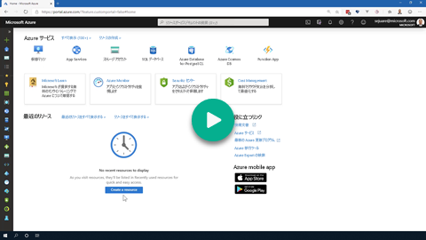
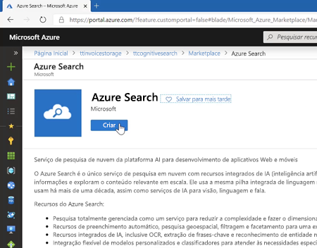
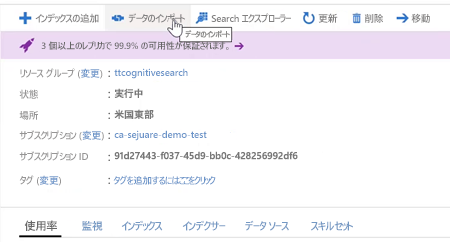
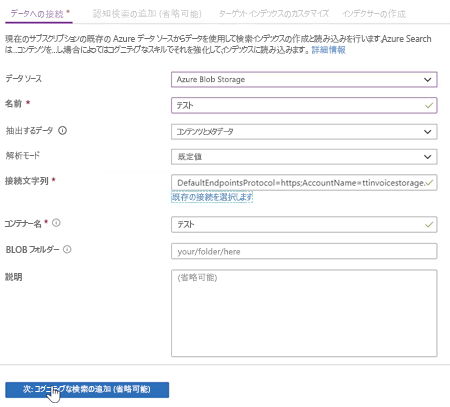
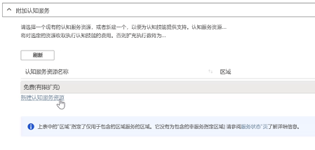
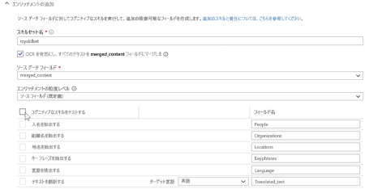
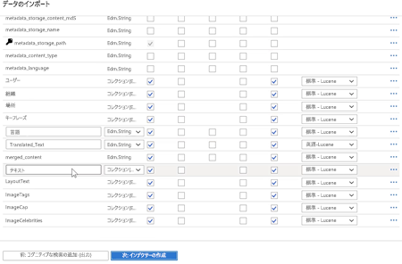
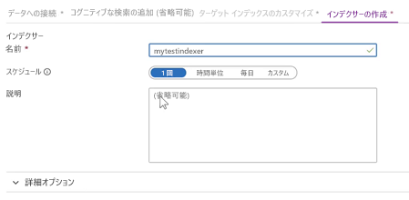
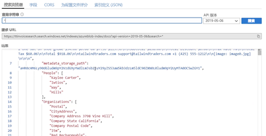

# Demo 1 - Azure Cognitive Search

[](https://globaleventcdn.blob.core.windows.net/assets/aiml/aiml10/videos/Demo1.mp4 "Demo 1")

## Summary
In this exercise we demonstrate the basic functions of Azure Cognitive Search in conjunction with the built-in intelligent skillset. There are a number of ways to create the resources required for this demo:
1. Follow along with the video above (each step is outlined), or
2. Use the [Azure CLI](https://docs.microsoft.com/en-us/cli/azure/install-azure-cli?view=azure-cli-latest&WT.mc_id=msignitethetour2019-github-aiml10)


## What you need
- [Invoice Test Set](https://globaleventcdn.blob.core.windows.net/assets/aiml/aiml10/data/test.zip)

## Azure Resources
These are the resources that we create in the first demonstration. While this table outlines the names of the resources as shown in the video, please use your own names for each of the resources.


| Name                       | Type                            | Purpose                    |
| -------------------------- | ------------------------------- | ------------------------- |
| **ttcognitivesearch**     | Resource Group                  | Groups services together   |
| **ttinvoicestorage**      | Storage Account                 | Used to store invoices     |
| **ttinvoicesearch**       | Search Service                  | Featured service           |
| **ttinvoiceintelligence** | Cognitive Services (All-In-One) | Used in the search service |


## What to do

There are three main steps:
1. Create a Resource Group
2. Create and use Storage Account
3. Create and use a Search Service resource


### Create a Resource Group
All of our resources will live in this group.

```
az group create --location {LOCATION} --name {YOUR_RG_NAME}
```

### Create and use Storage Account
The storage account is used primarily for storing invoices.

1. Create storage account

```
az storage account create --name {YOUR_STORAGE_NAME} --location {LOCATION} --resource-group {YOUR_RG_NAME} --sku Standard_LRS
```

2. Create a container called `test`

[](https://docs.microsoft.com/en-us/azure/storage/blobs/storage-quickstart-blobs-portal?WT.mc_id=msignitethetour2019-github-aiml10 "Create Container")

3. Download and unzip [invoice test set](https://globaleventcdn.blob.core.windows.net/assets/aiml/aiml10/data/test.zip).

4. Upload unzipped [invoice test set](https://globaleventcdn.blob.core.windows.net/assets/aiml/aiml10/data/test.zip) to the `test` container. This can be done directly using the [portal](https://docs.microsoft.com/en-us/azure/storage/blobs/storage-quickstart-blobs-portal?WT.mc_id=msignitethetour2019-github-aiml10#upload-a-block-blob) or by using the [Azure Storage Explorer](https://docs.microsoft.com/en-us/azure/vs-azure-tools-storage-explorer-blobs?WT.mc_id=msignitethetour2019-github-aiml10) application (as shown in the [video](https://globaleventcdn.blob.core.windows.net/assets/aiml/aiml10/videos/Demo1.mp4 "Demo 1")).

### Create and use a Search Service resource
Create a search service:

[](https://docs.microsoft.com/en-us/azure/search/search-create-service-portal?WT.mc_id=msignitethetour2019-github-aiml10 "Azure Search")


Use Search Service:

1. In the newly created service click on `Import Data`

[](https://docs.microsoft.com/en-us/azure/search/cognitive-search-quickstart-blob?WT.mc_id=msignitethetour2019-github-aiml10#create-the-enrichment-pipeline "Import Data")

2.Use an existing connection to the `test` container we created in our storage account by select 'Azure Blob Storage' and selecting your storage account

[](https://docs.microsoft.com/en-us/azure/search/cognitive-search-quickstart-blob?WT.mc_id=msignitethetour2019-github-aiml10#step-1-create-a-data-source "Import Data")

3. Create a new Cognitive Services resource

[](https://docs.microsoft.com/en-us/azure/search/cognitive-search-quickstart-blob?WT.mc_id=msignitethetour2019-github-aiml10#step-2-add-cognitive-skills "Create Cognitive Services")

4. Go back to the wizard and hit refresh. You should see the newly created service. 

5. You can now add any enrichments you like! Select the 'Enable OCR ...' checkbox to have access to more enrichments based on a merged content field

[](https://docs.microsoft.com/en-us/azure/search/cognitive-search-quickstart-blob?WT.mc_id=msignitethetour2019-github-aiml10#step-2-add-cognitive-skills "Add Enrichments")

6. After clicking on `Customize Target Index` review the proposed index and click `Create and Indexer`.

[](https://docs.microsoft.com/en-us/azure/search/cognitive-search-quickstart-blob?WT.mc_id=msignitethetour2019-github-aiml10#step-3-configure-the-index "First Index")

7. Give the new indexer a name and click `Submit`

[](https://docs.microsoft.com/en-us/azure/search/cognitive-search-quickstart-blob?WT.mc_id=msignitethetour2019-github-aiml10#step-4-configure-the-indexer "First Indexer")

8. Once the indexing has taken place feel free to try some queries:

[](https://docs.microsoft.com/en-us/azure/search/cognitive-search-quickstart-blob?WT.mc_id=msignitethetour2019-github-aiml10#query-in-search-explorer "First Search")

# Next Demo
Learn how to use the Form Recognizer Cognitive service by continuing on to [Demo 2 - Using Form Recognizer](demo2.md)
