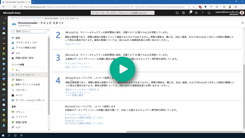
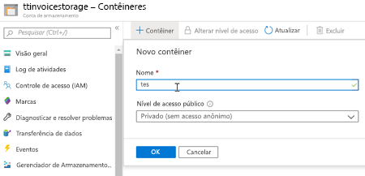
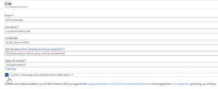
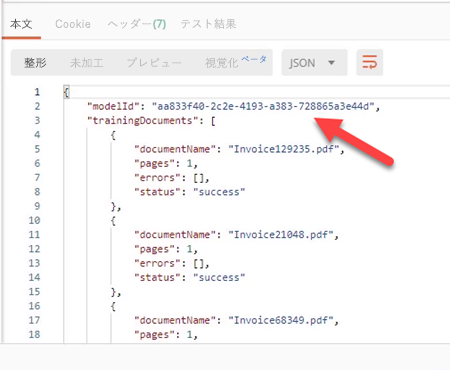
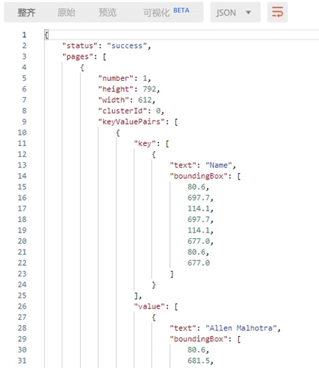

## Demo 2 - Using Form Recognizer

[](https://globaleventcdn.blob.core.windows.net/assets/aiml/aiml10/videos/Demo2.mp4 "Demo 2")

## Summary
In this exercise we learn how to use the Form Recognizer service. It is assumed that a storage account has been created (as described in the [first demo](demo1.md).)


## What you need
- [Invoice Training Set](https://globaleventcdn.blob.core.windows.net/assets/aiml/aiml10/data/training.zip)

- Access to the limited-access preview. To get access to the preview, fill out and submit the [Form Recognizer access request](https://aka.ms/FormRecognizerRequestAccess) form.

- [Postman](https://www.getpostman.com/) is used to send requests to the Form Recognizer service REST API. Refer to this [short primer](postman.md) to learn more.

- Postman Form Recognizer requests [collection](src/Collections/Form_Recognizer.postman_collection.json).

## Azure Resources
The only resource we work with in this demonstration is the Form Recognizer service.


| Name                       | Type                            | Purpose                    |
| -------------------------- | ------------------------------- | ------------------------- |
| **ttinvoicereader**       | Form Recognizer Service         | This service will eventually end up in the All-In-One sevice. For right now it is in limited-access preview. To get access to the preview, fill out and submit the [Form Recognizer access request](https://aka.ms/FormRecognizerRequestAccess) form.  |


## What to do

There are three main steps:
1. Upload training data to the storage account
2. Create Form Recognizer service
3. Train and Use Form Recognizer service

### Upload Training Data


1. Create a container called `train` in the storage account created in the previous demo.

[](https://docs.microsoft.com/en-us/azure/storage/blobs/storage-quickstart-blobs-portal?WT.mc_id=msignitethetour2019-github-aiml10 "Create Container")

2. Download and unzip [invoice training set](https://globaleventcdn.blob.core.windows.net/assets/aiml/aiml10/data/training.zip).

3. Upload unzipped [invoice training set](https://globaleventcdn.blob.core.windows.net/assets/aiml/aiml10/data/training.zip) to the `train` container. This can be done directly using the [portal](https://docs.microsoft.com/en-us/azure/storage/blobs/storage-quickstart-blobs-portal?WT.mc_id=msignitethetour2019-github-aiml10#upload-a-block-blob) or by using the [Azure Storage Explorer](https://docs.microsoft.com/en-us/azure/vs-azure-tools-storage-explorer-blobs?WT.mc_id=msignitethetour2019-github-aiml10) (as shown in the [video](https://globaleventcdn.blob.core.windows.net/assets/aiml/aiml10/videos/Demo2.mp4 "Demo 1")).

### Create Form Recognizer service

In order to do this you must have access to the Form Recognizer preview. To get access to the preview, fill out and submit the [Form Recognizer access request](https://aka.ms/FormRecognizerRequestAccess) form. 


[](https://docs.microsoft.com/en-us/azure/cognitive-services/form-recognizer/overview?WT.mc_id=msignitethetour2019-github-aiml10#request-access "Form Recognizer")

### Train the Form Recognizer Service

This section uses Postman and assumes you know about loading collections, handling variables, and setting pre-request scripts. To learn how to do these specific things we have included some [instructions](postman.md).

The table below lists the variables set during this section of the exercise:

| Name                       | Type                            | Purpose                    |
| -------------------------- | ------------------------------- | ------------------------- |
| `Ocp-Apim-Subscription-Key`       | Authorization         | Key for getting access to Form Recognizer service  |
| `endpoint`       | Variable         | Specifies the Form Recognizer endpoint  |
| `modelId`       | Variable         | Current Form Recognizer model (this is set in step 5)  |

1. Load the [Form Recognizer collection](src/Collections/Form_Recognizer.postman_collection.json) into Postman.

2. Set the `Ocp-Apim-Subscription-Key` authorization header as well as the `endpoint` variable to the Form Recognizer service (these can be found in the portal).

3. Open the `TrainModel` Request and change the Pre-request script to set the `storageAccount` variable to your storage account (in the video the variable is `ttinvoicestorage`) and the `SASValue` to the appropriate Secure Access Signature to the `train` container. To learn how to get a Secure Access Signature, refer to our [brief explanation](sas.md).

```javascript
pm.environment.set('storageAccount', '<YOUR STORAGE ACCOUNT>')
pm.environment.set('container', 'train')
pm.environment.set('SASValue', '<SAS>')
```

4. Hit Send on the Request. Your response should look something like this:



5. Set the `modelId` variable for the collection to the returned `modelId` indicated above.


### Use the Form Recognizer Service

1. Open the `AnalyzeForm` request. In the **Body** section click on the `Select Files` button to choose an invoice downloaded previously. After sending the request you should get something similar to:



# Next Demo
Learn how to create custom Invoice Reader Skill with Azure Functions by continuing on to [Demo 3 - Creating a Custom Invoice Reader Skill](demo3.md)
