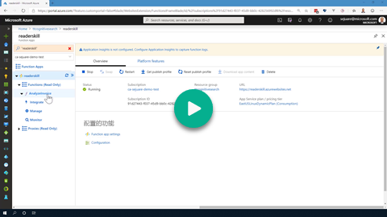
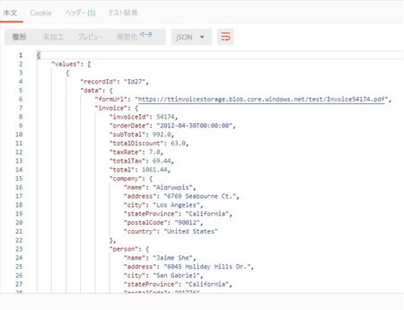
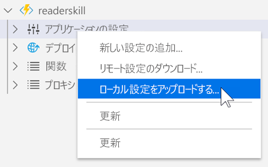
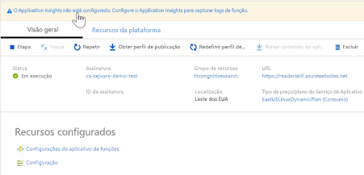

## Demo 3 - Creating a Custom Invoice Reader Skill

[](https://globaleventcdn.blob.core.windows.net/assets/aiml/aiml10/videos/Demo3.mp4 "Demo 3")

## Summary
In this exercise we create an Azure Search Skill (in the form of an Azure Function) that takes data from Azure Search and returns a structured json document representing the contents of the pdf Invoice. To get a more in depth treatment of creating an Azure Function please refer to the [docs](https://docs.microsoft.com/en-us/azure/azure-functions/functions-create-first-azure-function-azure-cli?WT.mc_id=msignitethetour2019-github-aiml10). It is assumed that a storage account has been created (as described in the [first demo](demo1.md) as well as the Form Recognizer service created in the [second demo](demo2.md))


## What you need
- [Invoice Test Set](https://globaleventcdn.blob.core.windows.net/assets/aiml/aiml10/data/test.zip) (used to test the Azure Function)


- [Postman](https://www.getpostman.com/) is used to send requests to the Form Recognizer service REST API. Refer to this [short primer](postman.md) to learn more.

- Postman Reader Skill Request [collection](src/Collections/Reader_Skill.postman_collection.json).

- [Azure Functions Core Tools](https://docs.microsoft.com/en-us/azure/azure-functions/functions-run-local?WT.mc_id=msignitethetour2019-github-aiml10#v2)

## Azure Resources
The table below describes the resources created throughout this exercise.

| Name                       | Type                            | Purpose                    |
| -------------------------- | ------------------------------- | ------------------------- |
| **readerskillstorage**   | Storage Account              | Storage used for Azure Function |
| **readerskill**          | Function App                 | Cognitive Skill App |
| **readerskill**          | App Insights                   | Adds insights to Function App |
| **EastUS2LinuxDynamicPlan** | App Service Plan                   | Consumption based plan for running Function App (this is created implicitly) |

## What to do

There are three main steps:
1. Run the `InvoiceReaderSkill` Azure Function locally
2. Create resources to support the `InvoiceReaderSkill` Azure Function
3. Run the `InvoiceReaderSkill` on Azure

### Run the Azure Function Locally

1. Download the [InvoiceReaderSkill](src/InvoiceReaderSkill) code found in this repo in [Visual Studio Code](https://code.visualstudio.com/) (make sure the [Azure Tools](https://marketplace.visualstudio.com/items?itemName=ms-vscode.vscode-node-azure-pack) are installed).

2. Add a `local.settings.json` file to the folder with the following contents:

```json
{
  "IsEncrypted": false,
  "Values": {
    "FUNCTIONS_WORKER_RUNTIME": "python",
    "AzureWebJobsStorage": "{AzureWebJobsStorage}",
    "FormsRecognizerEndpoint": "<YOUR_FORMS_ENDPOINT>.cognitiveservices.azure.com",
    "FormsRecognizerKey": "<YOUR_FORMS_KEY>",
    "ModelId": "<YOUR_TRAINED_MODEL_ID>"
  }
}
```
3. Run the `func host start` command to start the function.

4. Import the Postman Reader Skill Request [collection](src/Collections/Reader_Skill.postman_collection.json) to Postman

5. Open the `Local Forms Skills` Request and change the Pre-request script to set the `storageAccount` variable to your storage account (in the video the variable is `ttinvoicestorage`) and the `SASValue` to the appropriate Secure Access Signature to the `train` container. To learn how to get a Secure Access Signature, refer to our [brief explanation](sas.md).

```javascript
pm.environment.set('storageAccount', '<YOUR STORAGE ACCOUNT>')
pm.environment.set('container', 'test')
pm.environment.set('SASValue', '<SAS>')
```

6. Verify that the `POST` uri matches the one for the Azure Function (in our running of it we use `http://localhost:7071/api/AnalyzeInvoice`) and click on Send. You should get a response similar to that below:



### Create Azure Function Resources

It is assumed that the following commands are run in the same directory as the actual Function and you have logged into the Azure CLI using ```az login```

1. Run the following Azure CLI Commands to create the appropriate resources and publish the function:

Create Function Storage

```
az storage account create --name {FUNCTION_STORAGE} --location {LOCATION} --resource-group {YOUR_RG} --sku Standard_LRS
```

Create Function App
```
az functionapp create --resource-group {YOUR_RG} --consumption-plan-location {LOCATION} --name {FUNCTION_NAME} --storage-account {FUNCTION_STORAGE} --runtime python --os-type linux
```
Publish Function
```
func azure functionapp publish {FUNCTION_NAME} --build remote
```

2. Use Visual Studio Code to sync the local settings to the Azure Function by selecting the Azure button, navigating to the newly created function, right clicking on `Application Settings` and selecting `Upload Local Settings` (NOTE: Do not overwrite the existing variables).



3. Browse to the newly created Function App in the portal to add Application Insights to the service.



### Run the Azure Function in the Cloud

1. Open the `Cloud Forms Skills` Request and change the Pre-request script to set the `storageAccount` variable to your storage account (in the video the variable is `ttinvoicestorage`) and the `SASValue` to the appropriate Secure Access Signature to the `train` container. To learn how to get a Secure Access Signature, refer to our [brief explanation](sas.md).

```javascript
pm.environment.set('storageAccount', '<YOUR STORAGE ACCOUNT>')
pm.environment.set('container', 'test')
pm.environment.set('SASValue', '<SAS>')
```

2. Verify that the `POST` uri matches the one for the Azure Function (should look something like `https://<YOUR_ENDPOINT>.azurewebsites.net/api/AnalyzeInvoice`) and click on Send. You should get a response similar to that below:


# Next Demo
Learn how to tie everything together and finally build the end to end solution by continuing on to [Demo 4 - Tying it all together](demo4.md)
