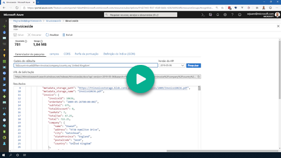
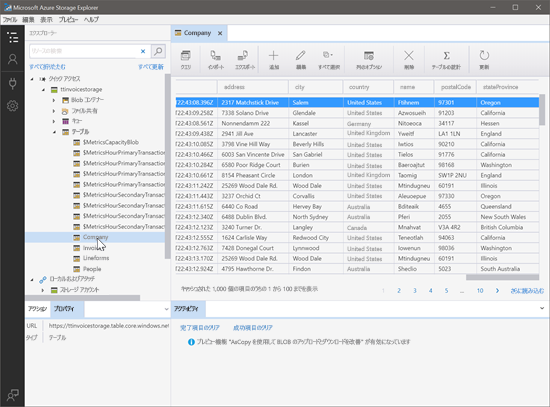

## Demo 5 - Knowledge Store

[](https://globaleventcdn.blob.core.windows.net/assets/aiml/aiml10/videos/Demo5.mp4 "Demo 5")

## Summary
In this exercise we explore the data pushed into the Knowledge Store by the Skillset created in the [previous exercise](demo4.md). This projection was part of the `Skillset` definition in the `Create Skillset` PUT request executed in previously. The portion of what was submitted to the service is as follows:

```json
"knowledgeStore": { 
  "storageConnectionString": "{{storageConnectionString}}", 
    "projections": [{ 
      "tables": [  
        { "tableName": "Invoices", "generatedKeyName": "InvoiceRef", "source": "/document/invoice" , "sourceContext": null, "inputs": []}, 
        { "tableName": "Company", "generatedKeyName": "CompanyRef", "source": "/document/invoice/company", "sourceContext": null, "inputs": []}, 
        { "tableName": "People", "generatedKeyName": "PersonRef", "source": "/document/invoice/person", "sourceContext": null, "inputs": []}, 
        { "tableName": "LineItems", "generatedKeyName": "LinteItemRef", "source": "/document/invoice/lineItems/*" ,"sourceContext": null, "inputs": []} 
      ]  
    }]
}
```
This used the `storageConnectionString` as the target of the projections. In this case it uses the Azure Storage tables that are part of our storage service in order to save the data.

## What to do
The only thing left to do is explore how the indexer used the skillset to project the data into our knowledge store. This can be done using the Microsoft [Azure Storage Explorer](https://docs.microsoft.com/en-us/azure/vs-azure-tools-storage-explorer-blobs?WT.mc_id=msignitethetour2019-github-aiml10):


