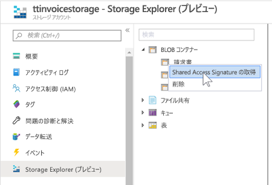
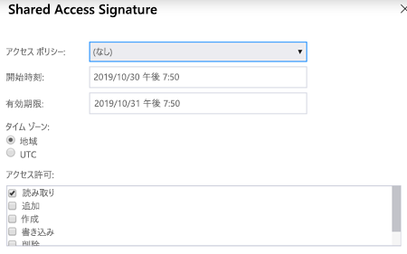
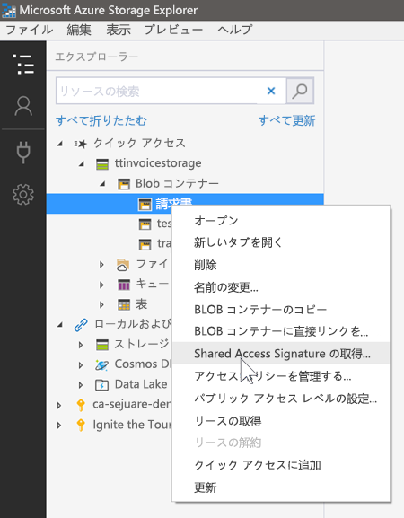
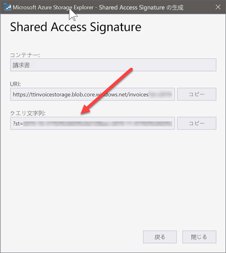

# Shared Access Signature

いくつかのデモでは、Azure ストレージ アカウントの BLOB にアクセスするために [Shared Access Signature](https://docs.microsoft.com/en-us/azure/storage/common/storage-sas-overview?WT.mc_id=msignitethetour2019-github-aiml10) を使用する必要があります。 これらは、Azure Search でインデックス付けされる BLOB への一時的なアクセスを許可するために使用されます。 ここでは、その方法について説明します。

## ポータルを使用する

1. ストレージ BLOB コンテナーに移動し、目的のコンテナーを右クリックして、[`Get Shared Access Signature`] を選択します

2. 署名の適切な開始時刻と有効期限を選択します。 これらの演習では、`Read` と `List` のアクセス許可を選択する必要があります (下にスクロールして [`List`] チェック ボックスをオンにします)

3. 次のようにクエリ文字列をコピーします。 

## Microsoft Azure Storage Explorer の使用

1. [Microsft Azure Storage Explorer](https://azure.microsoft.com/en-us/features/storage-explorer/?WT.mc_id=msignitethetour2019-github-aiml10) をダウンロードしてインストールします。

2. ストレージ BLOB コンテナーに移動し、目的のコンテナーを右クリックして、[`Get Shared Access Signature`] を選択します

3. 署名の適切な開始時刻と有効期限を選択します。 これらの演習では、`Read` と `List` のアクセス許可を選択する必要があります (下にスクロールして [`List`] チェック ボックスをオンにします)

4. 次のようにクエリ文字列をコピーします。 

