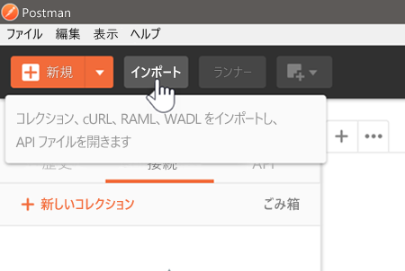
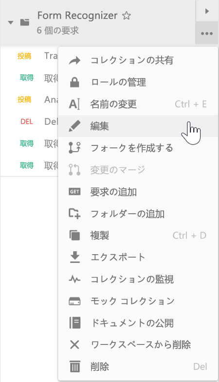
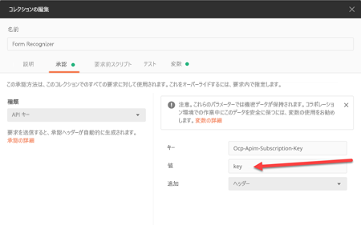
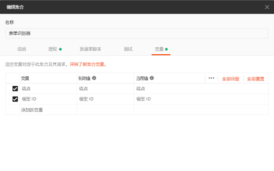
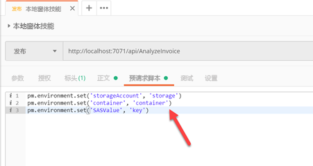

# Using Postman
There are three concepts needed to carry out the exercises in all of the demonstrations:

1. Import a collection
2. Set collection variables
3. Use the pre-requests scripts to set variables

## What you need
There are three collections used throughout the demos:
1. [Form Recognizer API Calls](src/Collections/Form_Recognizer.postman_collection.json)
2. [Reader Skill API Calls](src/Collections/Reader_Skill.postman_collection.json)
3. [Invoice Search API Calls](src/Collections/Invoice_Search.postman_collection.json)

## Importing a Collection

1. Download the appropriate collection (see above).
2. Open Postman
3. Click on Import

4. Select the appropriate collection

## Modifying collection variables

Collection variables allow Postman to replace tokens such as `{variable}` with values set by the user. This allows requests to be more portable with changes to variables. For example, the `endpoint` variable in some of the exercises represents the endpoint to your particular Form Recognizer service. 

1. After a collection is loaded, click on the ellipsis to edit the collection variables

2. To edit authorization variables use the authorization tab.

3. All other variables used in these exercises are found under the variables tab

## Using pre-request scripts

Some of the exercises require changes made to the pre-request scripts. These are accessible in the Pre-request Script section of individual Requests as shown below.

