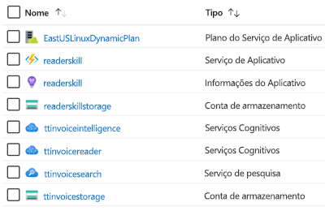

# AIML10: Compreensão do funcionamento de seus dados não estruturados com IA

### Resumo da Sessão

A Tailwind Traders tem muitos dados herdados que gostaria que seus desenvolvedores aproveitassem nos aplicativos da empresa – de várias fontes (estruturadas e não estruturadas) e que incluem imagens, formulários e vários outros. Nesta sessão, você aprenderá como a equipe usou o Azure Cognitive Search para compreender como esses dados funcionam em um curto período e com um sucesso incrível. Discutiremos vários conceitos de IA, tais como o padrão ingestão-enriquecimento-exploração, conjuntos de habilidades, habilidades cognitivas, processamento de linguagem natural, pesquisa visual computacional e muito mais.

# Visão Geral
Nesta solução, desenvolvemos um processo no qual pegamos um conjunto de faturas de PDF não estruturadas e geramos uma saída de tabela estruturada usando o Azure Cognitive Search com uma habilidade personalizada do Reconhecimento de Formulários. 

Ao criar essa solução, são criados alguns recursos do Azure ([avaliação gratuita aqui](https://azure.microsoft.com/en-gb/free/?WT.mc_id=msignitethetour2019-github-aiml10), se necessário). As tabelas a seguir listam cada recurso, sua finalidade e todas as instruções especiais necessárias para implementar totalmente a solução (usei os nomes apresentados durante a palestra, mas eles devem ser renomeados para a sua solução específica):

## Recursos do Azure

| Nome                       | Tipo                            | Finalidade                    |
| -------------------------- | ------------------------------- | ------------------------- |
| **ttcognitivesearch**     | Grupo de Recursos                  | Agrupar os serviços   |
| **ttinvoicestorage**      | Conta de armazenamento                 | Usada para armazenar faturas     |
| **ttinvoicesearch**       | Serviço de pesquisa                  | Serviço apresentado           |
| **ttinvoiceintelligence** | Serviços Cognitivos (Tudo-em-um) | Usados no serviço de pesquisa |
| **ttinvoicereader**       | Serviço Reconhecimento de Formulários         | Eventualmente, esse serviço acabará no serviço Tudo-em-um. No momento, ele está em visualização de acesso limitado. Para obter acesso à versão prévia, preencha e envie o formulário [Solicitação de acesso ao Reconhecimento de Formulários](https://aka.ms/FormRecognizerRequestAccess).  |
| **readerskillstorage**   | Conta de armazenamento              | Armazenamento usado na função do Azure |
| **readerskill**          | Aplicativo de Funções                 | Aplicativo de habilidades cognitivas |
| **readerskill**          | App Insights                   | Adiciona informações ao aplicativo de funções |
| **EastUS2LinuxDynamicPlan** | Plano do Serviço de Aplicativo                   | Plano baseado em consumo para executar Aplicativo de Funções |

# Apresentação

* [Download do PowerPoint](https://globaleventcdn.blob.core.windows.net/assets/aiml/aiml10/aiml10.pptx)
* [Vídeo da sessão do Microsoft Ignite Orlando](https://myignite.techcommunity.microsoft.com/sessions/82986?source=sessions)

# Demonstrações
Essa palestra consistiu nas cinco demonstrações listadas abaixo. 

- **Demonstração 1**: [Azure Cognitive Search](demo1.md)
- **Demonstração 2**: [Serviço Reconhecimento de Formulários](demo2.md) – esta demonstração requer acesso à versão prévia do Reconhecimento de Formulários. Para obter acesso à versão prévia, preencha e envie o formulário [Solicitação de acesso ao Reconhecimento de Formulários](https://aka.ms/FormRecognizerRequestAccess).
- **Demonstração 3**: [Criar uma Habilidade Personalizada de Leitura de Faturas](demo3.md)
- **Demonstração 4**: [Reunir tudo isso](demo4.md)
- **Demonstração 5**: [Repositório de Conhecimento](demo5.md)

# Instruções de desinstalação

### Desinstalação completa

* Entre no portal do Azure e exclua o **Grupo de Recursos do Azure** para remover todos os recursos criados para este projeto

# Recursos e aprendizado contínuo

**Microsoft Learn:**
* [Introdução ao Azure Search](https://docs.microsoft.com/en-us/learn/modules/intro-to-azure-search/?WT.mc_id=msignitethetour2019-github-aiml10)
* [Estratégia e soluções de IA (Inteligência Artificial) do Microsoft Azure](https://docs.microsoft.com/en-us/learn/modules/azure-artificial-intelligence/?WT.mc_id=msignitethetour2019-github-aiml10)

**Documentação do Azure**
* [O que é a "pesquisa cognitiva" no Azure Search?](https://docs.microsoft.com/en-us/azure/search/cognitive-search-concept-intro/?WT.mc_id=msignitethetour2019-github-aiml10)
* [O que é o repositório de conhecimento no Azure Search?](https://docs.microsoft.com/en-us/azure/search/knowledge-store-concept-intro)

# Loop de Comentários

Tem um comentário, feedback ou sugestão? Atualmente, a melhor forma de criar um ciclo de comentários para alterações/sugestões/feedback de conteúdo é abrindo um novo problema neste repositório GitHub. Para obter todos os detalhes sobre como criar um problema, confira a [Documentação de contribuição](https://github.com/microsoft/ignite-learning-paths/blob/master/contributing.md)

## Torne-se um apresentador treinado

Para se tornar um apresentador treinado, entre em contato com [scalablecontent@microsoft.com](mailto:scalablecontent@microsoft.com). Em seu email, inclua:

- Nome completo
- Código desta apresentação: aiml10
- Link para um vídeo da sua apresentação (aproximadamente 10 minutos) (por exemplo: vídeo do YouTube não listado). 
  > O conteúdo pode ser diferente deste treinamento. O importante é mostrar suas habilidades com o apresentador

Um orientador entrará em contato com as informações sobre o processo.

## Apresentadores treinados

Agradecemos a estas pessoas maravilhosas ([chave de emoji](https://allcontributors.org/docs/en/emoji-key)):

<!-- ALL-CONTRIBUTORS-LIST:START - Do not remove or modify this section -->
<!-- prettier-ignore -->

<table>
<tr>
    <td align="center"><a href="https://github.com/sethjuarez">
         
        <b>Seth Juarez</b></a> 
            <a href="Add link to powerpoint here" title="Documentação da">📢</a>palestra
            <a href="Add link to pull request here" title="">📖</a> 
    </td>
</tr></table>

<!-- ALL-CONTRIBUTORS-LIST:END -->