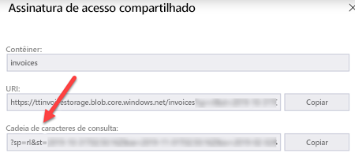

# Assinaturas de Acesso Compartilhado

Algumas demonstrações exigem o uso de [Assinaturas de acesso compartilhado](https://docs.microsoft.com/en-us/azure/storage/common/storage-sas-overview?WT.mc_id=msignitethetour2019-github-aiml10) para acessar blobs em uma conta de Armazenamento do Azure. Eles são usados para conceder acesso temporário aos blobs que o Azure Search indexará. Aqui, descrevemos duas maneiras para fazer isso.

## Usar o portal

1. Navegue até os contêineres de blob de armazenamento, clique com o botão direito do mouse no contêiner desejado e selecione `Get Shared Access Signature`

2. Selecione a hora de início e a hora de término apropriadas para a assinatura. Para esses exercícios, precisamos selecionar as permissões `Read` e `List` (role para baixo até encontrar a caixa de seleção `List`)

3. Copie a cadeia de caracteres de Consulta, como mostrado abaixo: 

## Usar o Gerenciador de Armazenamento do Microsoft Azure

1. Baixe e instale o [Gerenciador de Armazenamento do Microsoft Azure](https://azure.microsoft.com/en-us/features/storage-explorer/?WT.mc_id=msignitethetour2019-github-aiml10).

2. Navegue até os contêineres de blob de armazenamento, clique com o botão direito do mouse no contêiner desejado e selecione `Get Shared Access Signature`

3. Selecione a hora de início e a hora de término apropriadas para a assinatura. Para esses exercícios, precisamos selecionar as permissões `Read` e `List` (role para baixo até encontrar a caixa de seleção `List`)

4. Copie a cadeia de caracteres de Consulta, como mostrado abaixo: 

