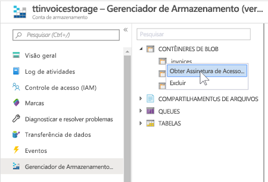
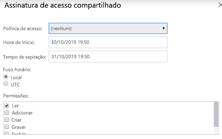
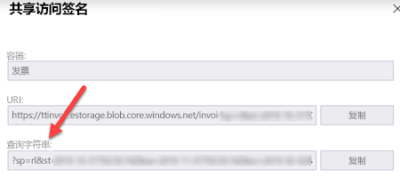
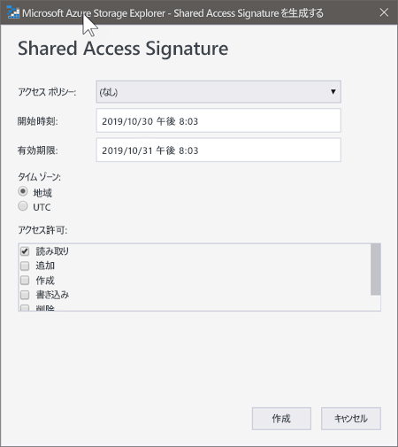
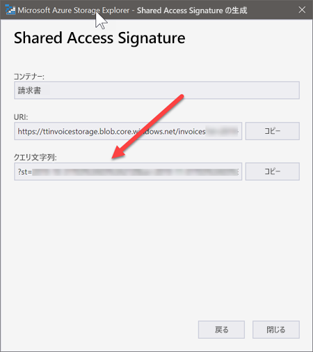

# Shared Access Signatures

A couple of demonstrations require the use of [Shared Access Signatures](https://docs.microsoft.com/en-us/azure/storage/common/storage-sas-overview?WT.mc_id=msignitethetour2019-github-aiml10) for accessing blobs in an Azure Storage account. These are used to grant temporary access to the blobs that Azure Search will index. Here we describe tow ways of doing that.

## Using the Portal

1. Navigate to the storage blob containers and right click on the desired container and select `Get Shared Access Signature`

2. Select the appropriate Start Time and Expiry time for the signature. For these exercises we need to select `Read` and `List` permissions (scroll down to finf the `List` checkbox)

3. Copy the Query string as shown below: 

## Using Microsoft Azure Storage Explorer

1. Download the [Microsft Azure Storage Explorer](https://azure.microsoft.com/en-us/features/storage-explorer/?WT.mc_id=msignitethetour2019-github-aiml10) and install.

2. Navigate to the storage blob containers and right click on the desired container and select `Get Shared Access Signature`

3. Select the appropriate Start Time and Expiry time for the signature. For these exercises we need to select `Read` and `List` permissions (scroll down to finf the `List` checkbox)

4. Copy the Query string as shown below: 

