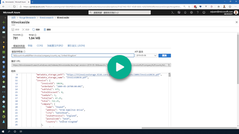
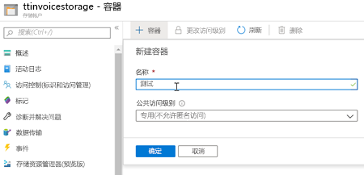
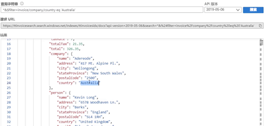

## <a name="demo-4---tying-it-all-together"></a>演示 4 - 组合

[](https://globaleventcdn.blob.core.windows.net/assets/aiml/aiml10/videos/Demo4.mp4 "演示 4")

## <a name="summary"></a>摘要
在本练习中，我们将所有资源组合到一起，以便在 Azure 认知搜索内部创建索引、技能集、数据源和索引器，用于从 pdf 文件集合中提取发票数据。 假设已创建并正确设置了前面练习中所述的所有资源和服务。


## <a name="what-you-need"></a>需要什么
- [发票数据集](https://globaleventcdn.blob.core.windows.net/assets/aiml/aiml10/data/invoices_1000.zip)（包含 1000 份发票的小数据集，用于运行服务和测试功能）


- [Postman](https://www.getpostman.com/) 用于将请求发送到表单识别器服务 REST API。 请参阅此[简短入门](postman.md)以了解详细信息。

- Postman [发票搜索请求集合](src/Collections/Invoice_Search.postman_collection.json)。

## <a name="what-to-do"></a>要执行的操作

有三个主要步骤：
1. 将发票上传到存储帐户
2. 准备 Azure 搜索索引、技能集、数据源和索引器
3. 监视和使用索引

### <a name="upload-invoice-data"></a>上传发票数据


1. 在存储帐户（已在第一篇演示中创建）中创建名为 `invoices` 的容器。

[](https://docs.microsoft.com/en-us/azure/storage/blobs/storage-quickstart-blobs-portal?WT.mc_id=msignitethetour2019-github-aiml10 "创建容器")

2. 下载并解压缩[发票数据集](https://globaleventcdn.blob.core.windows.net/assets/aiml/aiml10/data/invoices_1000.zip)。

3. 将解压缩的[发票数据集](https://globaleventcdn.blob.core.windows.net/assets/aiml/aiml10/data/invoices_1000.zip)上传到 `invoices` 容器。 可以直接通过[门户](https://docs.microsoft.com/en-us/azure/storage/blobs/storage-quickstart-blobs-portal?WT.mc_id=msignitethetour2019-github-aiml10#upload-a-block-blob)这样做，也可以通过 [Azure 存储资源管理器](https://docs.microsoft.com/en-us/azure/vs-azure-tools-storage-explorer-blobs?WT.mc_id=msignitethetour2019-github-aiml10)这样做。

### <a name="prepare-azure-search"></a>准备 Azure 搜索

本部分使用 Postman，并假设你了解如何加载集合、处理变量和设置预请求脚本。 若要了解如何执行这些特定的操作，请查看我们提供的一些[说明](postman.md)。

| 名称                       | 类型                            | 用途                    |
| -------------------------- | ------------------------------- | ------------------------- |
| `api-key`       | 授权         | Azure 搜索访问密钥  |
| `search_service`       | 变量         | 搜索服务 URL（不包含协议或斜杠）  |
| `index_name`       | 变量         | 所需索引的名称  |
| `storageConnectionString`       | 变量         | 包含发票的存储帐户的连接字符串  |
| `cog_svcs_key`       | 变量         | [演示 1](demo1.md) 中使用的一体式认知服务的密钥  |

1. 将[发票搜索请求集合](src/Collections/Invoice_Search.postman_collection.json)载入 Postman。

2. 按上表所述设置所有变量。 可以在门户上的相应服务中找到其中的每个值（`index_name` 除外）。 可以选择所需的任何 `index_name`。

3. 打开并运行 `Create Index` 请求（使用“发送”按钮）。 这会创建用于存储发票数据的索引。 请求成功完成后，门户上的 Azure 搜索服务中应会反映所做的更改：


4. 打开并运行 `Create Skillset` 请求（使用“发送”按钮）。 这会创建自定义技能集，供索引器用来提取发票数据。 此特定技能集只包含一个技能（自定义的 `InvoiceReaderSkill`）。 如上所述，如果请求成功完成，则门户中会反映新的技能集。

5. 打开并运行 `Create Datasource` 请求（使用“发送”按钮）。 这会创建对发票所在的存储帐户的引用。 如上所述，如果请求成功完成，则门户中会反映新的技能集。

6. 打开并运行 `Create Indexer` 请求（使用“发送”按钮）。 这会创建从 `Datasource` 提取发票、对每份发票使用 `Skillset`，并将数据存储在实际 `Index` 中的索引器。 如上所述，如果请求成功完成，则门户中会反映新的技能集。


### <a name="monitor-and-use-index"></a>监视和使用索引
索引器需要一段时间才能完成所有发票文档的处理。 可以在搜索服务本身中监视此过程。 还可以通过查看附加到 Azure 函数的相应 App Insights 服务中的实时指标流，来监视对 `InvoiceReaderSkill` 的调用。 索引中出现一些文档后，可以运行查询来验证索引是否正常工作：



**一些可运行的有趣查询**：

ItemId 为 49 的订单
```
*&$filter=invoice/lineItems/any(lineItems: lineItems/itemId eq 49)
```

invoiceId 为 12179
```
*&$filter=invoice/invoiceId eq 12179
```

澳大利亚公司
```
*&$filter=invoice/company/country eq 'Australia'
```

英国公司（以及计数）
```
*&$count=true&$filter=invoice/company/country eq 'United Kingdom'
```

仅检索发票
```
*&$select=invoice&$count=true
```

在德国的人
```
*&$count=true&$select=invoice/person&$filter=invoice/person/country eq 'Germany'
```

# <a name="next-demo"></a>下一演示
继续阅读[演示 5 - 知识存储](demo5.md)来了解如何浏览知识存储