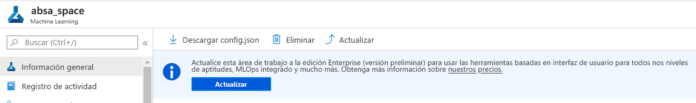
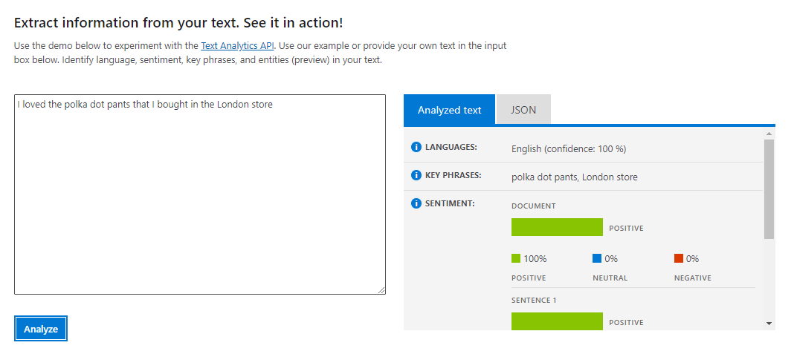
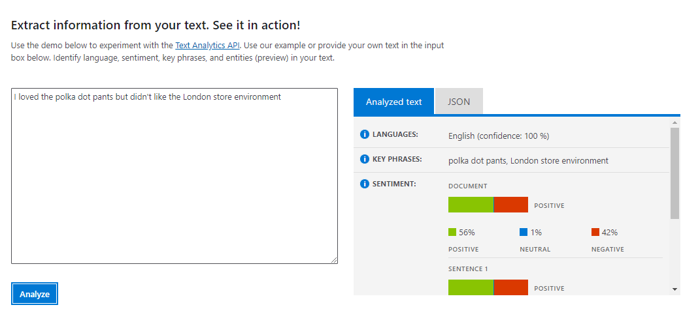

### Please note: This repository is no longer actively maintained and therefore cannot be guarenteed that code and instructions are the latest information. To find out more about [Azure AI services we recommend visting the documentation](https://docs.microsoft.com/en-us/azure/?product=ai-machine-learning)

# AIML40 - Taking Models to the Next Level with Azure Machine Learning Best Practices

## Session information

Artificial Intelligence and Machine Learning can be used in many ways to increase productivity of business processes and gather meaningful insights, by analyzing images, texts and trends within unstructured flows of data. While many tasks can be solved using existing models, in some cases it is also required to train your own model for more specific tasks, or for increased accuracy. 

In this session, we will explore the complete path of integrating text analysis intelligent services into the business processes of [Tailwind Traders](http://tailwindtraders.com), starting from pre-build models available as [cognitive services](https://azure.microsoft.com/services/cognitive-services/?WT.mc_id=msignitethetour2019-github-aiml40), up to training a third-party neural custom model for [Aspect-Based Sentiment Analysis](https://www.intel.ai/introducing-aspect-based-sentiment-analysis-in-nlp-architect/) available as part of [Intel NLP Architect](http://nlp_architect.nervanasys.com/) using [Azure Machine Learning Service](https://azure.microsoft.com/services/machine-learning-service/?wt.mc_id=msignitethetour2019-github-aiml40). We will talk about cases when one needs a custom model, and demonstrate quick ways to create such a model from scratch using [AutoML](https://docs.microsoft.com/azure/machine-learning/service/concept-automated-ml/?wt.mc_id=msignitethetour2019-github-aiml40), and show how to fine-tune model hyperparameters using [HyperDrive](https://docs.microsoft.com/azure/machine-learning/service/how-to-tune-hyperparameters/?wt.mc_id=msignitethetour2019-github-aiml40)

# Table of Content
 

| Resources          | Links                            |
|-------------------|----------------------------------|
| PowerPoint        | - [Presentation](presentations.md) |
| Videos            | - [Dry Run Rehearsal](https://youtu.be/If9IQm3gWVQ) <br/>- [Microsoft Ignite Orlando Recording](https://myignite.techcommunity.microsoft.com/sessions/83002?source=sessions) |
| Demos             | - [Demo 1 - Cognitive Services Text Analytics](https://github.com/microsoft/ignite-learning-paths-training-aiml/tree/master/aiml40#demo-1-text-analytics-cognitive-service) <br/>- [Demo 2 - Automated Machine Learning](https://github.com/microsoft/ignite-learning-paths-training-aiml/tree/master/aiml40#demo-2-azure-automl) <br/>- [Demo 3 - Azure Machine Learning SDK and Hyperdrive](https://github.com/microsoft/ignite-learning-paths-training-aiml/tree/master/aiml40#demo-3-using-azure-ml-workspace-with-python-sdk) |

## Delivery Assets

* [PowerPoint deck](https://github.com/microsoft/ignite-learning-paths-training-aiml/blob/master/aiml40/presentations.md)
* [Additional Presenter Resources](README-Instructor.md)
* Demonstration videos:
    * Demo 1 - [Cognitive Services Text Analytics](https://youtu.be/QJxjm5BirOA)
    * Demo 2 - [Automated Machine Learning](https://youtu.be/qrstXN6TLZk)
    * Demo 3 - [Azure Machine Learning SDK and Hyperdrive](https://youtu.be/sccNTPO3PwU)


## Overview of Demonstrations

In this presentation, the following demonstrations are made:

1. Using [Cognitive Services Text Analytics](https://azure.microsoft.com/services/cognitive-services/text-analytics/?wt.mc_id=msignitethetour2019-github-aiml40) to find out the sentiment of a clothing review
2. Using [Azure Automated ML](https://docs.microsoft.com/azure/machine-learning/concept-automated-ml?wt.mc_id=msignitethetour2019-github-aiml40) to build a text classifier almost with no code
3. Using [Azure Machine Learning Service](https://azure.microsoft.com/services/machine-learning-service/?wt.mc_id=msignitethetour2019-github-aiml40) to train an Aspect-Based Sentiment Analysis model.

>  💡 **IMPORTANT: You must run through all instructions and demos before going on stage to deliver this content**. The demos take a long time to run and process - therefore be conscious that preparation time for this session is key to success. Each section should be run so you gain an ID that you can substituted into the notebooks when on stage rather than waiting for experiments to finish (the session is not long enough to run a single experiment)

## Starting Fast

If you want to start right away, you can deploy all required resources via Azure Template. 

<a href="https://portal.azure.com/#create/Microsoft.Template/uri/https%3A%2F%2Fraw.githubusercontent.com%2Fmicrosoft%2Fignite-learning-paths-training-aiml%2Fmaster%2Faiml40%2Ftemplate%2Fazuredeploy.json" target="_blank">
 
</a>

Below we provide more detailed instructions for the demo so you can perform the steps manually to fully understand the concepts being shown.

# Initial Environment Setup

In order to perform Demo 2, you will need to:

1. Create an Azure Machine Learning Workspace
2. Create a Training Compute Cluster in Azure Machine Learning
3. Upload the data used for Automated ML model - [clothing_automl.xlsx](https://github.com/microsoft/ignite-learning-paths-training-aiml/blob/master/aiml40/dataset/clothing_automl.xlsx)

#### Creating Azure Machine Learning Workspace

The Azure ML Workspace can either be created:
* Manually from [Azure Portal](http://portal.azure.com/?wt.mc_id=msignitethetour2019-github-aiml40) ([here is the complete walk-through](https://docs.microsoft.com/azure/machine-learning/service/how-to-manage-workspace/?wt.mc_id=msignitethetour2019-github-aiml40))
* Deployed from the Azure Template provided
* Created through [Azure CLI](https://docs.microsoft.com/cli/azure/?view=azure-cli-latest&wt.mc_id=msignitethetour2019-github-aiml40) using the following commands:

```shell
az extension add -n azure-cli-ml
az group create -n absa -l westus2
az ml workspace create -w absa_space -g absa
```

> 💡 *IMPORTANT NOTE: We are using `absa_space` as a workspace name, and `absa` as the Azure Resource Group name. Also, we use *West US 2* as the datacenter location -- feel free to adjust it according to region where the demo will take place.*

> 💡 *IMPORTANT NOTE: You will need an enterpise level Azure Machine Learning workspace to complete Demo 2. When you log into the Azure portal and go to your Azure ML instance you will see the opportunity to upgrade 

#### Pre-creating Compute Cluster

For Demo 2, you need a compute cluster to profile the dataset and run the model. 

This can be done via instructions below:

* Go to [Azure ML Studio - ml.azure.com](http://ml.azure.com/?wt.mc_id=msignitethetour2019-github-aiml40) 
    * Choose the **Compute** section
    * Select **Training clusters** 
    * Select **New**
    * Provide a **Name** for your compute e.g. cpu-compute
    * Choose **Virtual Machine Size** e.g. Standard_D2_v2
    * Select **Low priority**
    * **Minimum** number of nodes 0 and **maximum** up to 5
    * Select **Create**


#### Uploading data to the workspace

In the datasets folder you will find the items listed below and their associated demo:
* **[DEMO 2 - Action Needed]** A dataset for Automated ML demo - [clothing_automl.xlsx](https://github.com/microsoft/ignite-learning-paths-training-aiml/blob/master/aiml40/dataset/clothing_automl.xlsx)
* **[DEMO 3 - NO Action Needed]** The large dataset [clothing_absa_train.csv](https://github.com/microsoft/ignite-learning-paths-training-aiml/blob/master/aiml40/dataset/clothing_absa_train.csv) to train the full aspect based sentiment analysis model for demo 3
* **[DEMO 3 - NO Action Needed]** A smaller debugging dataset for aspect based sentiment analysis model [clothing_absa_train_small.csv](https://github.com/microsoft/ignite-learning-paths-training-aiml/blob/master/aiml40/dataset/clothing_absa_train_small.csv)
* **[DEMO 3 - NO Action Needed]** A seperate validation set [clothing-absa-validation.json](https://github.com/microsoft/ignite-learning-paths-training-aiml/blob/master/aiml40/dataset/clothing-absa-validation.json) to test the model

To follow the Automated ML Demo, please upload the first dataset above to your workspace:
 * Go to [Azure ML Portal](http://ml.azure.com/?wt.mc_id=msignitethetour2019-github-aiml40)
 * Select **Datasets** tab -> **Create Dataset** -> **From Local Files**
 * Specify *Clothing_AutoML* as the dataset name
 * Leave **Tabular** as the dataset type, click **Next**
 * Leave default storage name, and click **Browse** to select the file `clothing_automl.xlsx` from this repository
 * Click **Next** to upload the file
 
 > 💡 IMPORTANT: You may encounter an error when uploading file, which says *CORS Error: Failed to set up CORS rules* [see screenshot](images/dataset_upload_error.png). If this happens, click on the link **CORS Settings**, on the CORS settings page under **Blob storage** select **Allowed methods** in the first line, and select **PUT** and **POST** methods in addition to **GET** and **HEAD** (see [the screenshot](images/dataset_upload_error_cors.png)). Click **Save**, and repeat the dataset upload process.

 * On the **Settings and preview** screen in **Column headers** drop down select **Use headers from the first file**
 * Click **Next** two times
 * On the final page choose the **Profile this dataset after creation** and from the drop down select the compute you just created.
 * Click **Create**.  


# Demos

## **Demo 1:** Text Analytics Cognitive Service

In this demo, we show how Text Analytics can do sentiment analysis of a phrase in a web interface.

1. Open [Text Analytics Page](https://azure.microsoft.com/services/cognitive-services/text-analytics/?WT.mc_id=msignitethetour2019-github-aiml40)
2. Scroll down to **see it in action** section and enter the phrase *I loved the polka dot pants that I bought in the london store*
3. Press **Analyze** to get the following result:



Note that Text Analytics does not only provide sentiment, but also extracts location and key words from text.

4. Now enter the phrase - *I loved the polka dot pants but didn't like the london store environment*



We can see the API extracts sentiment from the full sentence. However in Tailwind Traders case we want each entity to be analyzed for each sentiment - therefore we will need to create our own bespoke model in this case - following the 80:20 rule.

## **Demo 2:** Azure AutoML

> 💡 You must have completed the [environment setup](https://github.com/microsoft/ignite-learning-paths-training-aiml/tree/master/aiml40#starting-fast) before attempting to do the demo.

In this demo, we demonstrate how Automated ML can be used to build an ML model without coding.

1. Navigate to your Azure ML Workspace (created above) in the [http://ml.azure.com](http://ml.azure.com/?WT.mc_id=msignitethetour2019-github-aiml40)
2. Go to **Datasets** - you should see the previously uploaded dataset there (clothing_automl.xlsx). Please mention that you can also upload it here through the portal.
3. Select the dataset.
4. You will see the **Consume** tab. Please mention the **Sample usage** box and show the code that can be used to access the data programmatically, if needed.
5. From the **Explore** tab, have a look at the data. You can optionally select the **Profile** tab, to see some more detailed statistics about the data.
6. Go to **Automated ML** tab and click **New Automated ML Run**
7. On the dataset selection page, select *Clothing_AutoML* dataset and click **Next**
8. Chose the experiment name (eg. `AutoML`), **Rating** as the target column, and select compute to be used (use the cluster we have created). Click Next
9. Chose the type of prediction task -- **Classification**. You can optionally **Enable deep learning** but its not necessarily needed for this experiment and will mean longer running times
10. Now you are ready to click **Finish**.

The experiment will take quite a long time to run, because different algorithms will be investigated. If showing a demo, it would make sense to run this in advance and just show the results. To show the results, go to **Experiments** tab in the [Azure ML Portal](http://ml.azure.com), and select the experiment you have executed.

## **Demo 3:** Using the Azure ML Service with AzureML Python SDK

In this demo, we will run custom Python code that uses the Python Azure ML SDK to train, optimize and use the custom Aspect Based Sentiment Analysis (ABSA) model.

In order to build and run this demo, we recommend following the steps below:
* First follow all instructions from the [Demo 3 Readme file](absa/readme.md)
* This will setup the demo environment needed to run the full final section of the session (Building an Aspect Based Sentiment Analysis model using Azure Machine Learning). There are 3 files this setup will walk you through:
    * [setup.ipynb](absa/notebooks/setup.ipynb) - this will setup the full environment, all dependencies and all datasets and infrastructure needed to run the code
    * [absa.ipynb](absa/notebooks/absa.ipynb) - this will take you through training and evaluating and deploying an initial ABSA model.
    * [absa-hyperdrive.ipynb](absa/notebooks/absa-hyperdrive.ipynb) - this will take you through applying hyperparameter tuning your ABSA model.

#### **To get started with ABSA demo - [go here](absa/readme.md)**

## Tear Down

To free up cloud resources used during the demo, you need to delete Azure ML workspace and resource group:

```shell
az ml workspace delete --w absa_space -g absa
az group delete -n absa
```

## Presenter Resources

If you are going to present this content, please have a look at the [additional presenter resources](README-Instructor.md).

## Resources and Continue Learning

### Getting Started Series

* [Azure Cognitive Services Text Analytics API](https://aka.ms/TextCogSvc​)
* [Automated Machine Learning](https://aka.ms/AutomatedMLDoc​)
* [Hyperparameter Tuning](https://aka.ms/AzureMLHyperDrive​)
* [Azure ML Services and the Python SDK](https://aka.ms/AA3dzht) ​

### Other Materials

* [9 Advanced Tips for Production Machine Learning](http://aka.ms/9TipsProdML)
* [Intel Aspect-Based Sentiment Analysis Page](https://www.intel.ai/introducing-aspect-based-sentiment-analysis-in-nlp-architect/)
* Azure ML Best Practice Repos:
    * [Natural Language Processing](https://github.com/microsoft/nlp/)
    * [Computer Vision](https://github.com/microsoft/ComputerVision)
    * [Recommenders](https://github.com/microsoft/Recommenders)


## Feedback loop

Do you have a comment, feedback, suggestion? Currently, the best feedback loop for content changes/suggestions/feedback is to create a new issue on this GitHub repository. To get all the details about how to create an issue please refer to the [Contributing](../../contributing.md) docs
