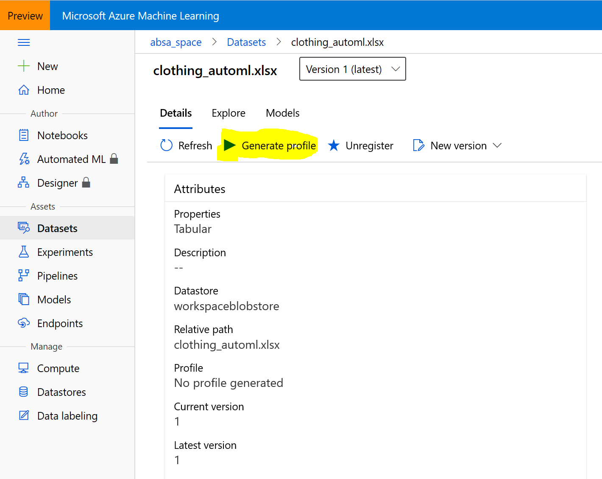

# AIML40 - Taking Models to the Next Level with Azure Machine Learning Best Practices

## Session information

Artificial Intelligence and Machine Learning can be used in many ways to increase productivity of business processes and gather meaningful insights, by analyzing images, texts and trends within unstructured flows of data. While many tasks can be solved using existing models, in some cases it is also required to train your own model for more specific tasks, or for increased accuracy. 

In this session, we will explore the complete path of integrating text analysis intelligent services into the business processes of [Tailwind Traders](http://tailwindtraders.com), starting from pre-build models available as [cognitive services](https://azure.microsoft.com/services/cognitive-services/?WT.mc_id=msignitethetour2019-github-aiml40), up to training a third-party neural custom model for [Aspect-Based Sentiment Analysis](https://www.intel.ai/introducing-aspect-based-sentiment-analysis-in-nlp-architect/) available as part of [Intel NLP Architect](http://nlp_architect.nervanasys.com/) using [Azure Machine Learning Service](https://azure.microsoft.com/services/machine-learning-service/?wt.mc_id=msignitethetour2019-github-aiml40). We will talk about cases when one needs a custom model, and demonstrate quick ways to create such a model from scratch using [AutoML](https://docs.microsoft.com/azure/machine-learning/service/concept-automated-ml/?wt.mc_id=msignitethetour2019-github-aiml40), and show how to fine-tune model hyperparameters using [HyperDrive](https://docs.microsoft.com/azure/machine-learning/service/how-to-tune-hyperparameters/?wt.mc_id=msignitethetour2019-github-aiml40)

## Table of Content
 

| Resources          | Links                            |
|-------------------|----------------------------------|
| PowerPoint        | - [Presentation](presentations.md) |
| Videos            | - [Dry Run Rehearsal](https://youtu.be/If9IQm3gWVQ) <br/>- [Microsoft Ignite Orlando Recording](https://myignite.techcommunity.microsoft.com/sessions/83002?source=sessions) |
| Demos             | - [Demo 1 - Cognitive Services Text Analytics](https://github.com/microsoft/ignite-learning-paths-training-aiml/tree/master/aiml40#demo-1-text-analytics-cognitive-service) <br/>- [Demo 2 - Automated Machine Learning](https://github.com/microsoft/ignite-learning-paths-training-aiml/tree/master/aiml40#demo-2-azure-automl) <br/>- [Demo 3 - Azure Machine Learning SDK and Hyperdrive](https://github.com/microsoft/ignite-learning-paths-training-aiml/tree/master/aiml40#demo-3-using-azure-ml-workspace-with-python-sdk) |

## Delivery Assets

* [PowerPoint deck](https://github.com/microsoft/ignite-learning-paths-training-aiml/blob/master/aiml40/presentations.md)
* [Additional Presenter Resources](README-Instructor.md)
* Demonstration videos:
    * Demo 1 - [Cognitive Services Text Analytics](https://youtu.be/QJxjm5BirOA)
    * Demo 2 - [Automated Machine Learning](https://youtu.be/qrstXN6TLZk)
    * Demo 3 - [Azure Machine Learning SDK and Hyperdrive](https://youtu.be/sccNTPO3PwU)


## Overview of Demonstrations

In this presentation, the following demonstrations are made:

1. Using [Cognitive Services Text Analytics](https://azure.microsoft.com/services/cognitive-services/text-analytics/?wt.mc_id=msignitethetour2019-github-aiml40) to find out the sentiment of a clothing review
2. Using [Azure Automated ML](https://docs.microsoft.com/azure/machine-learning/concept-automated-ml?wt.mc_id=msignitethetour2019-github-aiml40) to build a text classifier almost with no code
3. Using [Azure Machine Learning Service](https://azure.microsoft.com/services/machine-learning-service/?wt.mc_id=msignitethetour2019-github-aiml40) to train an Aspect-Based Sentiment Analysis model.

## Starting Fast

If you want to start right away, you can deploy all required resources via Azure Template. 

<a href="https://portal.azure.com/#create/Microsoft.Template/uri/https%3A%2F%2Fraw.githubusercontent.com%2Fmicrosoft%2Fignite-learning-paths-training-aiml%2Fmaster%2Faiml40%2Ftemplate%2Fazuredeploy.json" target="_blank">
 
</a>

Below we provide more detailed instructions for the demo so you can perform the steps manually to fully understand the concepts being shown.

## Initial Environment Setup

In order to perform steps 2 and 3 of the demo, we would need to:

1. Create an Azure Machine Learning Workspace
2. Upload the data used for AutoML training - [clothing_automl.xlsx](https://github.com/microsoft/ignite-learning-paths-training-aiml/blob/master/aiml40/dataset/clothing_automl.xlsx)

#### Creating Azure Machine Learning Workspace

The Azure ML Workspace can either be created:
* Manually from [Azure Portal](http://portal.azure.com/?wt.mc_id=msignitethetour2019-github-aiml40) ([here is the complete walk-through](https://docs.microsoft.com/azure/machine-learning/service/how-to-manage-workspace/?wt.mc_id=msignitethetour2019-github-aiml40))
* Deployed from the Azure Template provided
* Created through [Azure CLI](https://docs.microsoft.com/cli/azure/?view=azure-cli-latest&wt.mc_id=msignitethetour2019-github-aiml40) using the following commands:

```shell
az extension add -n azure-cli-ml
az group create -n absa -l westus2
az ml workspace create -w absa_space -g absa
```

> 💡 *IMPORTANT NOTE: We are using `absa_space` as a workspace name, and `absa` as the Azure Resource Group name. We will refer to those names several times during the preparation and demo, so it would be best not to change them. If you change them, however, you will need to pay attention and adjust some of the commands accordingly. Also, we use *West US 2* as the datacenter location -- feel free to adjust it according to region where the demo will take place.*

You would also need to know your subscription id, which can be obtained by running `az account list`.

#### Uploading data to the workspace

In our demos, we use a few datasets:
* A dataset for Automated ML demo - [clothing_automl.xlsx](https://github.com/microsoft/ignite-learning-paths-training-aiml/blob/master/aiml40/dataset/clothing_automl.xlsx)
* The large dataset [clothing_absa_train.csv](https://github.com/microsoft/ignite-learning-paths-training-aiml/blob/master/aiml40/dataset/clothing_absa_train.csv) to train the full aspect based sentiment analysis model for demo 3
* A smaller debugging dataset for aspect based sentiment analysis model [clothing_absa_train_small.csv](https://github.com/microsoft/ignite-learning-paths-training-aiml/blob/master/aiml40/dataset/clothing_absa_train_small.csv)
* A seperate validation set [clothing-absa-validation.json](https://github.com/microsoft/ignite-learning-paths-training-aiml/blob/master/aiml40/dataset/clothing-absa-validation.json) to test the model

To follow the Automated ML Demo, please upload the dataset to your workspace:
 * Go to [Azure ML Portal](http://ml.azure.com/?wt.mc_id=msignitethetour2019-github-aiml40)
 * Select **Datasets** tab -> **Create Dataset** -> **From Local Files**
 * Specify *Clothing_AutoML* as the dataset name
 * Leave **Tabular** as the dataset type, click **Next**
 * Leave default storage name, and click **Browse** to select the file `clothing_automl.xlsx` from this repository
 * Click **Next** to upload the file
 * You may encounter an error when uploading file, which says *CORS Error: Failed to set up CORS rules* [see screenshot](images/dataset_upload_error.png). If this happens, click on the link **CORS Settings**, on the CORS settings page under **Blob storage** select **Allowed methods** in the first line, and select **PUT** and **POST** methods in addition to **GET** and **HEAD** (see [the screenshot](images/dataset_upload_error_cors.png)). Click **Save**, and repeat the dataset upload process.
 * Click **Next** two times, on the final page select **Profile the dataset after creating** and click **Create**.  

The Automated ML clothing dataset would be uploaded to the AML service datastore by the demo code.

Also, in order to use Automated ML feature, you need to convert the workspace to the *Enterprise* level. This can be done by clicking on **Automated ML** tab, and choosing the option to upgrade the workspace. This operation only takes a few seconds.

#### Using the Azure ML Demo Code

You can execute demo code from any Jupyter Notebook Environment. We recommend using Jupyter Notebooks that are built into the Azure ML Service, because it requires much less installation steps. Instructions on using other options are in [separate notebook setup document](notebook-setup.md).

To use Jupyter Notebooks from within Azure ML Workspace:
    - Navigate to your [Azure ML Portal](https://ml.azure.com/)
    - Select **Notebooks** from left-hand-side menu
    - Upload `absa.ipynb` file (click the button with the arrow) and select it in the file pane
    - To be able to execute the notebook, select **+ New VM** from the top menu of the notebook, and create the new notebook VM.
    - Now you can use the notebook directly from the portal
    - To open the Jupyter Notebook in a full-screen browser (not inside the ML Portal), select **Jupyter** -> **Open in Jupyter** in the top menu (depending on the screen resolution it may be hidden under `...` button)

In order to connect to your workspace from the Python code in `absa.ipynb`, you would need to provide workspace data. You can either:
 * Insert your subscription id into the code in `absa.ipynb`, and uncomment the following code:
```python
subscription_id = 'd04ba089-....'
resource_group  = 'absa'
workspace_name  = 'absa_space'
ws = Workspace(subscription_id = subscription_id, resource_group = resource_group, workspace_name = workspace_name)
ws.write_config()
```
 * Or, you can download `config.json` file through the Azure Portal and upload it to the same folder as `absa.ipynb`, in which case the command `ws = Workspace.from_config()` will load this data and connect to the workspace automatically.

> 💡 **Note**: Some code inside `absa.ipynb` file takes **really a long time** to run. In order to demonstrate it to the audience, you need to pre-run some cells in advance, and then only run some cells to show the results. There is a separate file called `absa-instructions.ipynb`, which contains the same code with additional comments on which cells need to be run during demo, and which need to be skipped. Please refer to this file during preparation, and make sure to run cells in `absa.ipynb` before the actual demo.

#### Pre-creating Compute Cluster

For the last two demos, you need a compute cluster. For demo purposes, we will create a cluster that consists of one node only. This can be done in one of two ways:

* **Recommended**: Through [Azure ML Portal](http://ml.azure.com/?wt.mc_id=msignitethetour2019-github-aiml40) go to **Compute** section and manually create Azure ML Compute cluster with *Standard_DS3_v2* VMs, specifying number of nodes = 1. Name the cluster `absa-cluster`. 
* Run first few cells from `absa.ipynb` notebook which will create the cluster for you.

#### Generate dataset profile

In order to show the AutoML demo, you need to *generate profile* for `clothing_automl.xlsx` dataset. This is a time-consuming operation and should be done before the demo. The easiest way to do it is through the portal:

1. Go to [Azure ML Portal](https://ml.azure.com)
2. Select **Datasets** -> Clothing_automl.xlsx
3. Chose **Generate Profile** button

4. Select the compute -- you can use the cluster that you have created on the previous step
5. Profile generation task will be scheduled
6. You can monitor the task in the **Experiments** tab on Azure ML Portal. 

## Demos

### Demo 1: Text Analytics Cognitive Service

> 💡 You must have completed the [environment setup](https://github.com/microsoft/ignite-learning-paths-training-aiml/tree/master/aiml40#starting-fast) before attempting to do the demo.

In this demo, we show how Text Analytics can do sentiment analysis of a phrase in a web interface.

1. Open [Text Analytics Page](https://azure.microsoft.com/services/cognitive-services/text-analytics/?WT.mc_id=msignitethetour2019-github-aiml40)
2. Scroll down to **see it in action** section and enter the phrase *I loved the polka dot pants that I bought in the london store* (You can also leave the default phrase to demonstrate the point).
3. Press **Analyze** to get the following result:


Note that Text Analytics does not only provide sentiment, but also extracts location and key words from text.

### Demo 2: Azure AutoML

> 💡 You must have completed the [environment setup](https://github.com/microsoft/ignite-learning-paths-training-aiml/tree/master/aiml40#starting-fast) before attempting to do the demo.

In this demo, we demonstrate how Automated ML can be used to build an ML model without coding.

1. Navigate to your Azure ML Workspace (created above) in the [http://ml.azure.com](http://ml.azure.com/?WT.mc_id=msignitethetour2019-github-aiml40)
2. Go to **Datasets** - you should see the previously uploaded dataset there (clothing_automl.xlsx). Please mention that you can also upload it here through the portal.
3. Select the dataset.
4. You will see the **Details** tab. Please mention the **Sample usage** box and show the code that can be used to access the data programmatically, if needed.
5. From the **Explore** tab, have a look at the data. You can optionally select the **Profile** tab, to see some more detailed statistics about the data.
6. Go to **Automated ML** tab and click **New Automated ML Run**
7. On the dataset selection page, select *Clothing_AutoML* dataset and click **Next**
8. Chose the experiment name (eg. `AutoML`), **Rating** as the target column, and select compute to be used (use the cluster we have created).
9. Chose the type of prediction task -- **Classification**. You can optionally **Enable deep learning**
10. Now you are ready to click **Start**.

The experiment will take quite a long time to run, because different algorithms will be investigated. If showing a demo, it would make sense to run this in advance and just show the results. To show the results, go to **Experiments** tab in the [Azure ML Portal](http://ml.azure.com), and select the experiment you have executed.

### Demo 3: Using Azure ML Workspace with Python SDK

> 💡 You must have completed the [environment setup](https://github.com/microsoft/ignite-learning-paths-training-aiml/tree/master/aiml40#starting-fast) before attempting to do the demo.

In this demo, we will run custom Python code that uses the Python Azure ML SDK to train, optimize and use the custom Aspect Based Sentiment Analysis (ABSA) model.

All of the instructions for this part of the demo are located in the Jupyter Notebook itself. Use one of the methods described above to run the Notebook (in Azure Notebooks, or locally), and follow instructions there. 

## Tear Down

To free up cloud resources used during the demo, you need to delete Azure ML workspace and resource group:

```shell
az ml workspace delete --w absa_space -g absa
az group delete -n absa
```

## Presenter Resources

If you are going to present this content, please have a look at the [additional presenter resources](README-Instructor.md).

## Resources and Continue Learning

### Getting Started Series

* [Azure Cognitive Services Text Analytics API](https://aka.ms/TextCogSvc​)
* [Automated Machine Learning](https://aka.ms/AutomatedMLDoc​)
* [Hyperparameter Tuning](https://aka.ms/AzureMLHyperDrive​)
* [Azure ML Services and the Python SDK](https://aka.ms/AA3dzht) ​

### Other Materials

* [9 Advanced Tips for Production Machine Learning](http://aka.ms/9TipsProdML)
* [Intel Aspect-Based Sentiment Analysis Page](https://www.intel.ai/introducing-aspect-based-sentiment-analysis-in-nlp-architect/)
* Azure ML Best Practice Repos:
    * [Natural Language Processing](https://github.com/microsoft/nlp/)
    * [Computer Vision](https://github.com/microsoft/ComputerVision)
    * [Recommenders](https://github.com/microsoft/Recommenders)


## Feedback loop

Do you have a comment, feedback, suggestion? Currently, the best feedback loop for content changes/suggestions/feedback is to create a new issue on this GitHub repository. To get all the details about how to create an issue please refer to the [Contributing](../../contributing.md) docs
