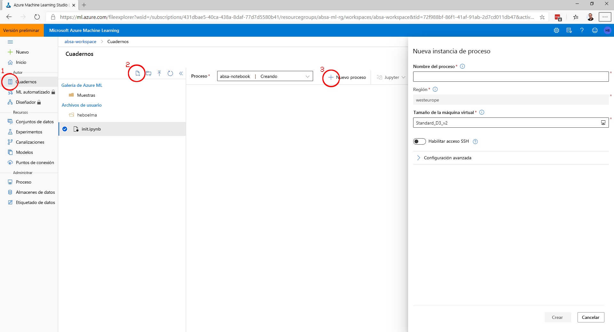
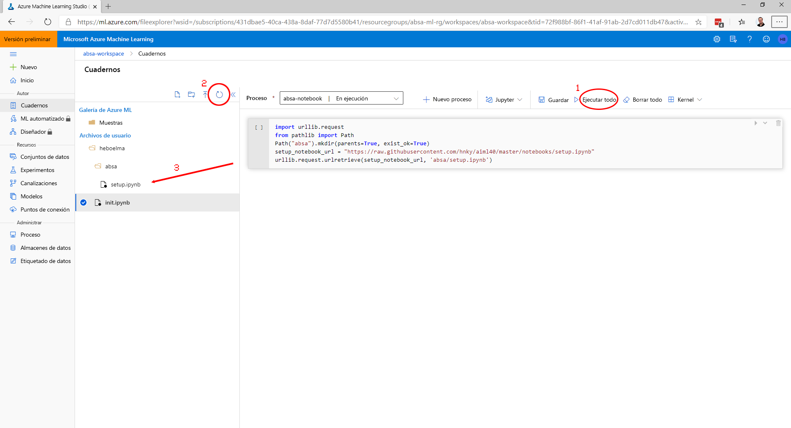

# Setup Azure Machine Learning demo

The easiest way to setup an enviroment is to use the Azure CLI with the Azure Machine Learning add-on

### Install the Azure CLI
Follow the instructions on docs: [Install the Azure CLI](https://docs.microsoft.com/en-us/cli/azure/install-azure-cli?view=azure-cli-latest/?wt.mc_id=msignitethetour2019-github-aiml40)

### Install the ML Add on
```
az extension add -n azure-cli-ml
```

### OR

Use the [Azure Cloud Shell](https://docs.microsoft.com/en-us/azure/cloud-shell/overview/?wt.mc_id=msignitethetour2019-github-aiml40) to execute the commands below

### Login to your subscription
> If you are using the cloud shell you do not need to log into your subscription. Move straight to Setup the Azure Machine Learning Service

```
az login
az account list
az account set -s <subscription_id> 
```

### Setup the Azure Machine Learning Service
The commands below will create an empty resource group 'absa-ml-rg' and a new workspace 'absa-workspace' in region west europe.
```
az group create -l westeurope -g absa-ml-rg
az ml workspace create -w absa-workspace -l westeurope -g absa-ml-rg
```

- Navigate to: [ml.azure.com](https://ml.azure.com/)
- Select your subscription and workspace
- (1) In the left menu Navigate to Notebooks
- (2) Click on 'create new file'
- Create a new file with file name: "init.ipynb" and File type: Python Notebook. Leave target directory as preselected.
- (3) Click on 'new compute'
- Create a New Compute Instance: Compute name: 'absa-notebook-youralias' (compute name needs to be unique) and Virtual Machine size: 'Standard_D3_v2' Leave everything else default.
- Wait until your compute is created *(you need to click refresh sometimes)*



- Click on the file "init.ipynb"
- Paste the code below in the cell

```
import urllib.request
from pathlib import Path
Path("absa").mkdir(parents=True, exist_ok=True)
setup_notebook_url = "https://raw.githubusercontent.com/microsoft/ignite-learning-paths-training-aiml/master/aiml40/absa/notebooks/setup.ipynb"
urllib.request.urlretrieve(setup_notebook_url, 'absa/setup.ipynb')
```

- (1) Click on "Run All"
- (2) Click on the "refesh button"
- Notice that a folder 'absa' has been created


- Open the folder 'absa'
- Click on "setup.ipynb"
- Click on the Jupyter dropdown and select: 'Open in Jupyter'
- Run all the cells in the Notebook (Use shift + enter to run a single cell)


## Your workspace is now ready to run the demos.

> you may need to refresh the 'Notebooks' screen to see changes

### Demo 1 - ABSA
- Under "Notebooks" open the folder absa/notebooks
- click on 'absa.ipynb'
- Click on the Jupyter dropdown and select: 'Open in Jupyter'
- Run through the complete notebook 
 - It should run without any changes
 - Follow some inline instructions to make your demo smoother

### Demo 2 - ABSA Hyperparamaters
- Under "Notebooks" open the folder absa/notebooks
- click on 'absa-hyperdrive.ipynb'
- Click on the Jupyter dropdown and select: 'Open in Jupyter'
- Run through the complete notebook 
 - It should run without any changes
 - Follow some inline instructions to make your demo smoother
